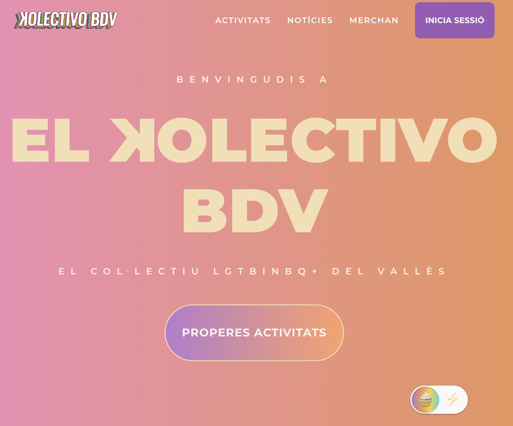

# elKolectivoBDV-app

[](https://el-kolectivo-bdv-app.vercel.app)

elKolectivoBDV-app és la plataforma web oficial de l’associació Kolectivo BDV.  
Centralitza en un sol lloc la gestió i participació en activitats de la comunitat, el seguiment de notícies i novetats, la consulta i compra de merchandising i molts altres recursos interns.  
Inclou autenticació amb rols per a usuaris i administradors, inscripció amb capacitat en temps real, pujada d’imatges i comunicacions via EmailJS, tot amb un disseny responsiu, temes dinàmics i integració completa amb Firebase i Cloudinary.  
Construïda amb **React 18**, **Vite**, **TypeScript**, **React Router**, **Firebase** (Auth, Firestore, Storage), **Cloudinary**, **EmailJS** i **Chart.js**.

[](src/assets/readme/home-full.png)

## 🚀 Demo

[🔗 Prova-la aquí](https://el-kolectivo-bdv-app.vercel.app)

## ✨ Característiques

-   🔐 **Autenticació completa** amb Firebase: registre, inici de sessió (email i Google), recuperació de contrasenya i rols (`user`, `admin`) per control d’accés.
-   🗓 **Gestió d’activitats** amb inscripcions, capacitat en temps real, modal d’assistents i afegit ràpid a Google Calendar/ICS.
-   📰 **Secció de notícies** per mantenir la comunitat informada.
-   🛍 **Merchandising** i llista d’espera integrada.
-   🧩 **Quiz interactiu** per a membres amb visualització de resultats en gràfiques
-   📁 **Recursos interns** per a membres i administradors.
-   🎨 **Design tokens** i temes dinàmics (pastel/energetic) per coherència visual.
-   📱 **Disseny responsiu** amb **CSS Modules** i **CSS “vanilla”** per mantenir el control total dels estils i components compartits (`Button`, `Card`, `Navbar`).
-   📧 **Enviament de correus** mitjançant EmailJS per a formularis i notificacions.
-   ☁️ **Pujada i gestió d’imatges** amb Cloudinary (unsigned upload).
-   ⚡ **Routing protegit** i animacions de transició de pàgines amb React Router.

## 🛠 Stack tècnic

-   **Frontend:** React 18, Vite, TypeScript, React Router DOM, Chart.js
-   **Estils:** CSS Modules + CSS “vanilla” + design tokens i temes dinàmics
-   **Backend-as-a-Service:** Firebase (Authentication, Firestore, Storage)
-   **Gestió d’imatges:** Cloudinary (unsigned upload)
-   **Comunicacions per correu:** EmailJS

---

## 🛠️ Instal·lació

Clona el repositori i instal·la dependències:

```bash
git clone https://github.com/Jperaire/elKolectivoBDV-app.git
cd elKolectivoBDV-app
npm install
```

### 1) Configura Firebase

1. Crea un projecte a [Firebase Console](https://console.firebase.google.com).
2. Afegeix una **Web App** i copia la configuració.
3. Activa **Authentication** i habilita **Email/Password** i **Google**.

    - A **Authentication → Settings → Authorized domains**, afegeix `localhost` i el teu domini de producció (`el-kolectivo-bdv-app.vercel.app`).

4. Activa **Cloud Firestore** i **Cloud Storage**.

### 2) Configura EmailJS

1. Crea un compte a [EmailJS](https://www.emailjs.com).
2. Dona d’alta un **Service**, un **Template** i obtén el **Public Key**.
3. Copia els IDs al `.env`.

### 3) Configura Cloudinary

1. Crea un compte a [Cloudinary](https://cloudinary.com).
2. Obté el teu **Cloud Name** i crea un **Unsigned Upload Preset**.
3. Defineix també una carpeta (per ex. `activities`) si vols organitzar pujades.

### 4) Variables d’entorn

Crea un fitxer `.env` a la arrel del projecte seguint el format de `.env.example`.

> ⚠️ **No comparteixis** el `.env` real ni claus privades al repo.
> Vite només exposa variables que comencen per `VITE_`.

### 5) Executa el servidor de desenvolupament

```bash
npm run dev
```

Obre [http://localhost:5173](http://localhost:5173) al navegador per veure l’aplicació.

### 6) Build de producció

```bash
npm run build
npm run preview
```

Podem ampliar una mica aquesta secció perquè reflecteixi tot el que es pot fer a la plataforma, però mantenint-la curta i senzilla. Et proposo això:

---

## 🧭 Ús

1. **Registra’t o inicia sessió** (també pots utilitzar Google o recuperar la contrasenya si cal).
2. **Explora les activitats** disponibles, inscriu-te i comprova la capacitat en temps real.
3. **Consulta les notícies i novetats** de la comunitat.
4. **Revisa i apunta’t al merchandising** disponible o a la llista d’espera.
5. **Accedeix a recursos interns** o a la zona d’administració (si tens rol d’admin) per gestionar activitats, membres i contingut.
6. **Completa el quiz interactiu** i observa els teus resultats amb gràfiques.

## 📁 Estructura principal (`src`)

```
app
├── guards
├── layout
└── routes
assets
├── fonts
├── gifs
└── images
features
├── activities
├── auth
├── members
├── merch
├── news
└── theme
lib
└── firebase
pages
├── admin
├── public
└── user
shared
├── components
├── hooks
├── services
└── utils
styles
├── variables.css
├── reset.css
└── … (fonts, forms, layout, table, typography, etc.)
App.tsx
main.tsx
vite-env.d.ts
```
